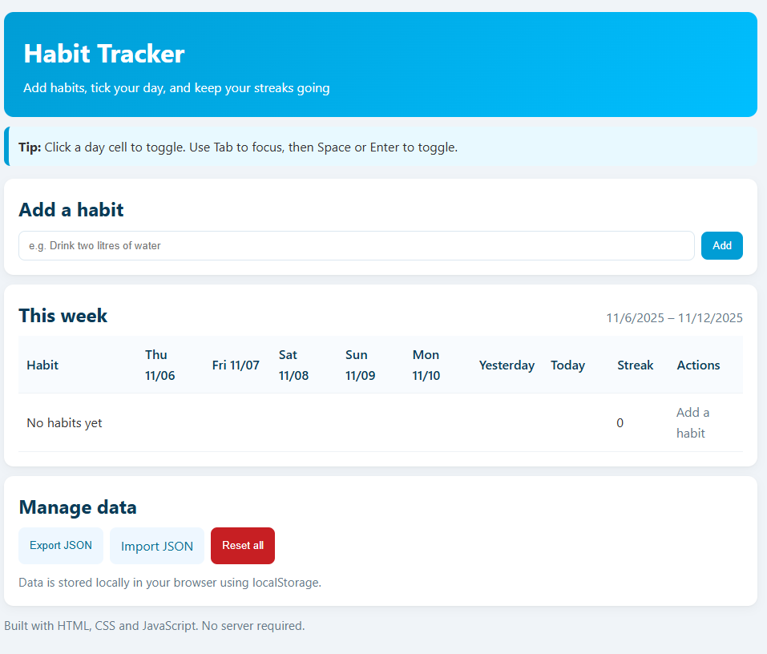
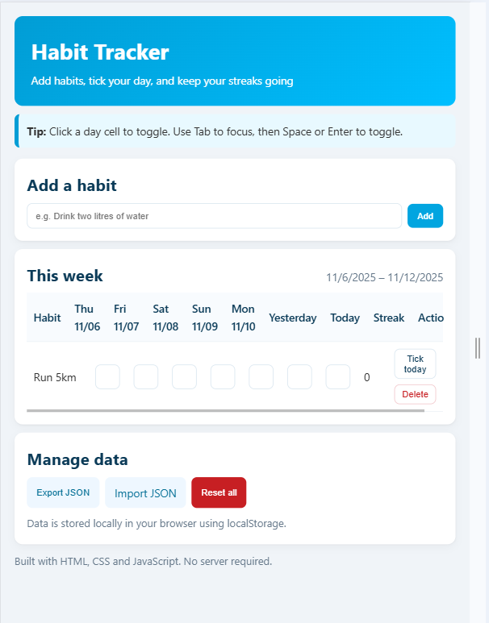
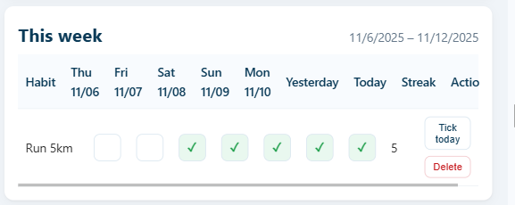

# 🎯 Habit Tracker - Weekly Tracking

## Video Presentation Timestamps

| Part | Description | Start Time |
| :--- | :--- | :--- |
| **I. Intro** | Greeting, project background, and the problem solved. | **0:00** |
| **II. Overview** | Architecture, technologies used, and core features (7-day lookback). | **0:48** |
| **III. Demo** | Data entry, streak processing, and JSON export flow. | **1:24** |
| **IV. Conclusion** | Summary and key learning: The challenge of DOM performance optimization. | **2:17** |

## Short Description and Key Features

Habit Tracker is a simple Single-Page Application (SPA) implemented with pure HTML, CSS, and JavaScript. It is designed to help users track their daily habits in real-time, calculate current streaks, and persist data locally in the browser's memory (localStorage).

## Key Features:

- Habit Addition: Users can dynamically add new habits to track.
- Weekly Tracking: Displays the last seven days (D-6, D-5, ..., Yesterday, Today).
- Status Logging: Clicking day cells marks a habit as completed or uncompleted. Logging for future dates is prevented.
- Streak Calculation: Automatically calculates consecutive days of successful completion.
- Data Management: Supports data export (Export JSON), data import (Import JSON), and a full data reset.
- Local Storage: All data is stored in the browser's localStorage between sessions.

## How to Run Locally (Windows and macOS)
This application is a static web page that does not require a backend server. It can be opened directly in your browser.

## Requirements:
- A modern web browser (Chrome, Firefox, Edge, or Safari).
- Files: index.html (or habit_tracker.html), app.js, and styles.css (or equivalent files, if CSS is inline).

## 1. File Placement
Ensure you have the following files in the same folder:
- index.html (or habit_tracker.html - the main structure)
- app.js (the JavaScript logic)
- styles.css (the CSS styles, if separate)

## 2. Opening the Application
- Navigate to the folder where the files are located in your file explorer.
- Double-click the index.html (or habit_tracker.html) file.
- The file will automatically open in your default browser, and the application will be ready to use.

## Screenshots

# Self-Assessment (According to Canvas Rubric Headings)

## Code Quality and Structure
Assessment: I have adhered to the principles of clean, basic web technologies. The code is logically divided into an HTML structure, CSS styles (though now inline in the working file), and JavaScript logic.
- The JavaScript logic utilizes clear DOM manipulation (rendering) and event handlers.
- Global variables (state, weekKeys, ROWS_CONTAINER) are defined at the beginning of app.js, which resolved previous ReferenceError issues.

## Functionality
Assessment: All required core functionalities are working:
- Adding habits, marking days as completed, and deleting habits.
- Streak calculation works correctly by checking consecutive days backward.
- localStorage persists the state.
- Data export and import work with JSON files.
- Selecting future days is prevented both in the user interface and in the logic.

## Usability and Accessibility
Assessment: The user interface is responsive (using the viewport meta-tag and inline styles to support this). I have paid attention to accessibility:
- Interactive elements (buttons) have clear aria-label and role="checkbox" attributes.
- Focus (:focus) is styled to be visible.
- Keyboard navigation is supported (Tab navigation and Enter/Space to activate the button).

## Testing and Error Handling
Assessment: Basic error handling is implemented:
- try...catch blocks are used for handling JSON data (localStorage and import/export).
- alert() and confirm() windows are used to provide feedback and confirm deletions.
- The logic includes checks (if (!name), if (!h), if (dateKey > todayKey())) to prevent the application from crashing due to invalid input.

# Reflection

Implementing this Habit Tracker project was an excellent exercise in understanding Vanilla JavaScript and traditional DOM manipulation. One of the biggest lessons learned was the relationship between State Management and UI rendering without a modern framework. Every user action (adding a habit, clicking a day) requires updating the entire application state (state) in memory (localStorage) and then completely re-drawing the user interface (render() function), which is a typical challenge in this architecture.

Another significant learning experience was the critical importance of utility functions. The ReferenceError bugs encountered during debugging highlighted how essential it is to define global variables (state, weekKeys) and utility functions (loadState, setupDates) before they are called in other parts of the code, and to ensure that DOM elements (ROWS_CONTAINER) are available.

## Improvement Suggestions for the Next Iteration:
- Architectural Shift: Moving to a library like React, Vue, or Angular would make DOM updates significantly more efficient and easier to maintain. This would eliminate the need to call the render() function every time.

- UI Components: Replacing the alert() and confirm() functions with custom, styled modal components would improve the user experience and unify the visual look.

- Style Modernization: Replacing inline styles and the large <style> block with Tailwind CSS or separate, modular CSS files would improve code readability and scalability.

- Data Persistence: Although localStorage suffices for this task, a cloud database (like Firebase Firestore) would be necessary to enable multi-user or cross-device tracking.